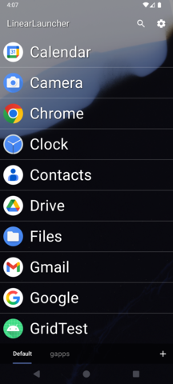
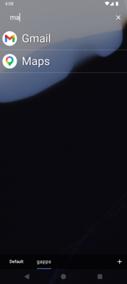
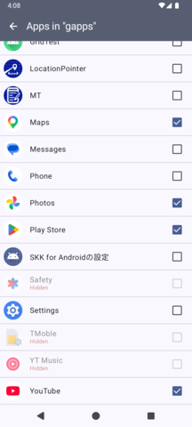

# LinearLauncher
[日本語](readme_jp.md)

This is a lightweight app launcher.

## Control

It shows a list of installed apps, and you can choose to launch an app.  The five most recently launched apps are displayed at the top of the list.  The history size can be set in the Settings screen.

When you enter something in the search box, only matching items will be displayed.  If only one item is displayed after filtering, you can also launch the app also by pressing the enter key in the search box.

## Hiding apps

You can hide several apps from the list.  Go to "Hide apps" in the Settings screen and uncheck the items that you want to hide.

## Groups

At first, there is only one tab named "Default" at the bottom.  You can add a new tab by pressing the "+" button.

Long-press a tab to add apps to a tab, reorder tabs, or delete a tab.  Note that this is a feature "showing only selected apps," so an app can belong to multiple tabs.

## Misc.

- Pinch-to-zoom is available on the main screen.
- Long pressing on a list item will display the application details screen, rather than launching the app.
